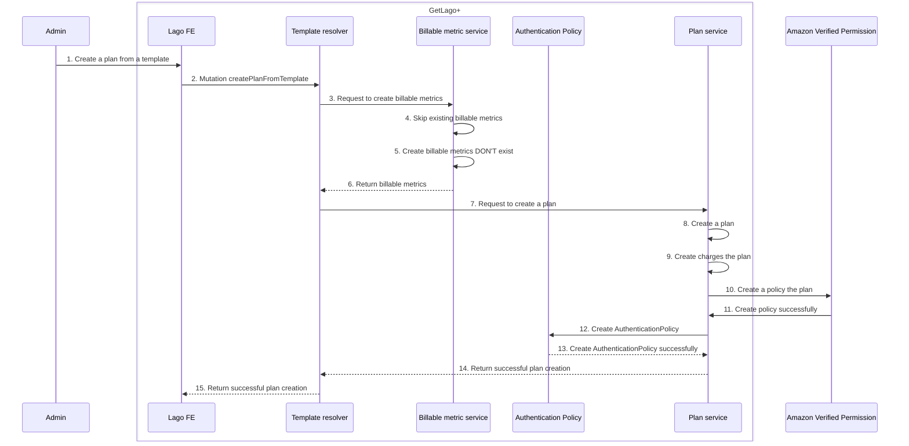

# pinet-charts

```mermaid 
sequenceDiagram

participant U as Admin
box GetLago+
participant AP as Lago FE
participant GQL as Template resolver
participant B as Billable metric service
participant ApP as Authentication Policy
participant P as Plan service
end
participant AVP as Amazon Verified Permission

U ->> AP: 1. Create a plan from a template
AP ->> GQL: 2. Mutation createPlanFromTemplate
GQL ->> B: 3. Request to create billable metrics
B ->> B: 4. Skip existing billable metrics
B ->> B: 5. Create billable metrics DON'T exist
B -->> GQL: 6. Return billable metrics
GQL ->> P: 7. Request to create a plan
P ->> P: 8. Create a plan
P ->> P: 9. Create charges the plan
P ->> AVP: 10. Create a policy the plan
AVP ->> P: 11. Create policy successfully
P ->> ApP: 12. Create AuthenticationPolicy
ApP -->> P: 13. Create AuthenticationPolicy successfully
P -->> GQL: 14. Return successful plan creation
GQL -->> AP: 15. Return successful plan creation
```