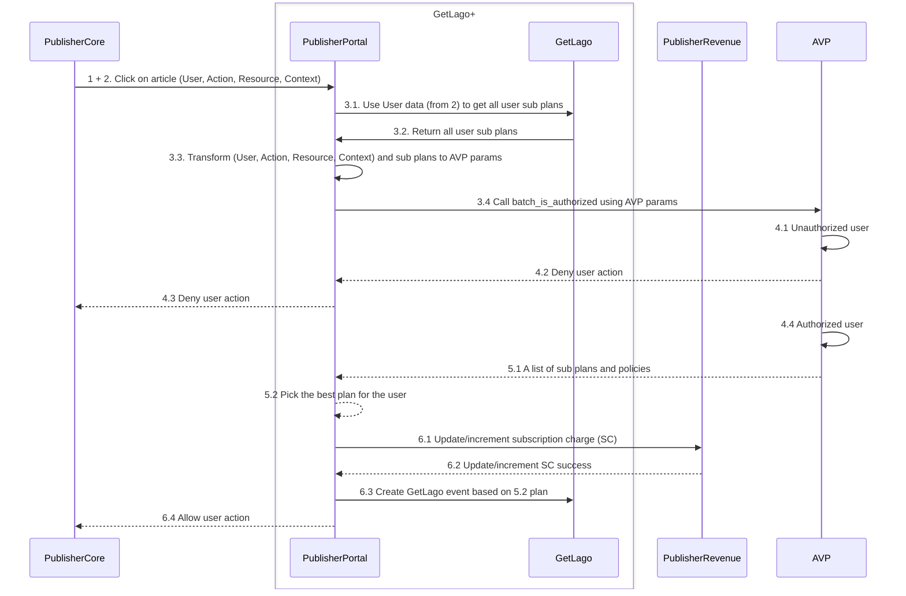

```mermaid
sequenceDiagram

participant PC as PublisherCore
box GetLago+
participant PP as PublisherPortal
participant GL as GetLago
end
participant PR as PublisherRevenue

PC->>PP: 1 + 2. Click on article (User, Action, Resource, Context)
PP->>GL: 3.1. Use User data (from 2) to get all user sub plans
GL->>PP: 3.2. Return all user sub plans
PP->>PP: 3.3. Transform (User, Action, Resource, Context) and sub plans to AVP params
PP->>AVP: 3.4 Call batch_is_authorized using AVP params
AVP->>AVP: 4.1 Unauthorized user
AVP-->>PP: 4.2 Deny user action
PP-->>PC: 4.3 Deny user action
AVP->>AVP: 4.4 Authorized user
AVP-->>PP: 5.1 A list of sub plans and policies
PP-->>PP: 5.2 Pick the best plan for the user
PP->>PR: 6.1 Update/increment subscription charge (SC)
PR-->>PP: 6.2 Update/increment SC success
PP->>GL: 6.3 Create GetLago event based on 5.2 plan
PP-->>PC: 6.4 Allow user action
```