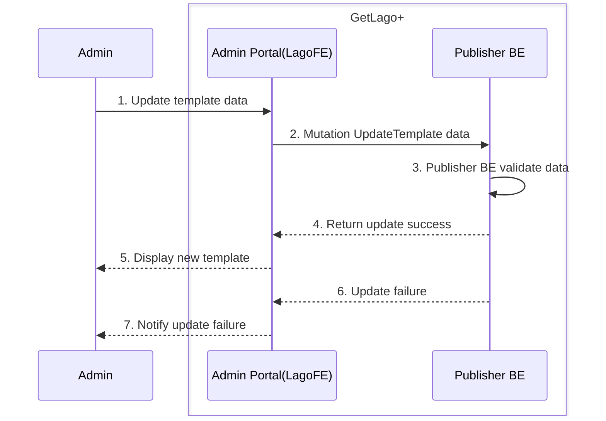

```mermaid
sequenceDiagram

participant U as Admin
box GetLago+
participant AP as Admin Portal(LagoFE)
participant L as Publisher BE
end

U ->> AP: 1. Update template data
AP ->> L: 2. Mutation UpdateTemplate data
L ->> L: 3. Publisher BE validate data
L -->> AP: 4. Return update success
AP -->> U: 5. Display new template
L -->> AP: 6. Update failure
AP -->> U: 7. Notify update failure
```